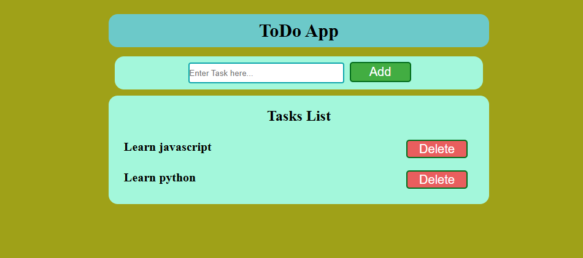

# ToDo-App-in-javascript
## About Todo project
Hello guys, I am create this Todo app using HTML,CSS and JavaScript.
I am use vs code id for develope this app.
i hope it is very usefull for time management and task management.
it is also helpfull to improve productivity 

## features

>You can add new tasks
>You can also delete tasks after completion
## some images

